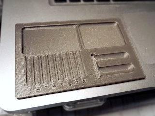

# Lock Pinning Tray (LPL style)
*Lock Pinning Tray (Lock Picking Lawyer style) (formerly thing:3140402)*

### License
[Creative Commons - Attribution](https://creativecommons.org/licenses/by/4.0/)

### Gallery

[🔎](images/pintray1.jpg) [🔎](images/pintray2.jpg) [🔎](images/pintray3.jpg)

## Description and Instructions

This is a pinning tray for arranging all the parts while disassembling and re-pinning locks. The design is inspired by the metal tray as often used by [TheLockPickingLawyer](https://www.youtube.com/channel/UCm9K6rby98W8JigLoZOh6FQ).

I still provide the old v1 and v2 models, but you'll probably want to print the **v3** model. It is more refined, has slightly larger slots, and also comes in a variant with one single large recess (like LPL's original) instead of 2 separated ones.

This was designed in Blender, the source file is provided.

### Printing

I eyeballed the dimensions from LPL's videos. After buying one of the tools that LPL also has and comparing dimensions in video screenshots, I figured out that my model is a tad small. To print the tray at a similar size as LPL's original, you should scale up the model to approximately 115% or 120%, although it is also perfectly usable at 100% scale.

You can print this pretty much in any way and material you want. I printed it at 0.15 mm layers with 15% infill. The silver one in the photos is v3 in PLA, the dark gray one is the v1 model printed in ABS.

## License

This model has a license that allows to sell prints without requiring to first ask explicit permission from the author, if you follow certain rules.

### Practical: what to do when selling prints

If you want to print and sell this model, keep in mind that it is released under a [Creative Commons Attribution license](https://creativecommons.org/licenses/by/4.0/). My interpretation of this license is the following.

* If you **sell or give away prints** of this model, you need to **provide attribution.** This means you must always provide *a clearly visible reference* to the source of the model, both on the webpage where you sell or display the model, and on a piece of paper included with each physical product. **This is a very easy requirement** that does not incur any significant extra cost. Here is an example of a full attribution message:\
  “[Lock Pinning Tray (LPL style) by DrLex](https://github.com/DrLex0/print3d-lockpinningtray-lpl-style) on GitHub, released under a [*Creative Commons Attribution* license](https://creativecommons.org/licenses/by/4.0/).”\
  For the required attribution message on your website/store, simply copy the above line, ensure the hyperlink to this GitHub page is preserved (or re-add it), and you're done.\
  As for the physical printed object, put a similar message on a piece of paper. Print it, write it, 3D print it, I don't care as long as it's there. Simplest is to use the ready-to-print attribution cards in PDF format that can be found in this repository.
* If you **remix** this model and you sell prints of that remix, the origin should be attributed as described in the previous point. You can change the message to: *“Based on Lock Pinning Tray (LPL style) by DrLex.”* You don't need to use the same attribution cards, but it must be obvious that your prints were derived from my model, and must provide a link to this GitHub page.
* You are *not* obliged to make the 3D model for a **remix** available, this is not a `SA` license. If you do publish the 3D model, it must have the same `CC BY` license or a more restrictive one. You must provide a visible link to this GitHub page wherever your remixed model is published.
* You **do not need to ask explicit permission** from me to sell prints of this model or a remix. Just do the above. Of course it is fine for you to drop me a message, but you don't need to.
* You **do not need to share profits,** although of course you may. [On my site you can find a few ways to donate](https://www.dr-lex.be/about/#contact), should you want to.

### Practical: when displaying this model on a webpage or in a video

To comply with the [Creative Commons Attribution license](https://creativecommons.org/licenses/by/4.0/), you need to provide *attribution,* which is really simple.

* If you display **photos** of the 3D model or 3D printed copies on a webpage: add the same kind of attribution message as when selling objects. In other words, this one:\
  “[Lock Pinning Tray (LPL style) by DrLex](https://github.com/DrLex0/print3d-lockpinningtray-lpl-style) on GitHub, released under a [*Creative Commons Attribution* license](https://creativecommons.org/licenses/by/4.0/).”\
  If there really is no way to provide hyperlinks, the above line of text, possibly as a text overlay in the image, suffices because it contains enough information for people to find this source page, but you must provide links when possible.
* If you show the model or prints of it in a **video:** include the same message, either spoken, in a text overlay, or in the video's ‘end credits.’ If the video has a separate textual description, add the same message with link as above.

## Updates

### 2018/10/06
First published on Thingiverse.

### 2019/03/30
Added v2 model that makes it easier to slide pins and springs from the recess into the individual slots.

### 2024/06/01
Migrated to GitHub. Added v3 model with single recess variant.

## Tags
`lockpicking`, `Locksmith`, `locksport`, `pinning`, `tray`
